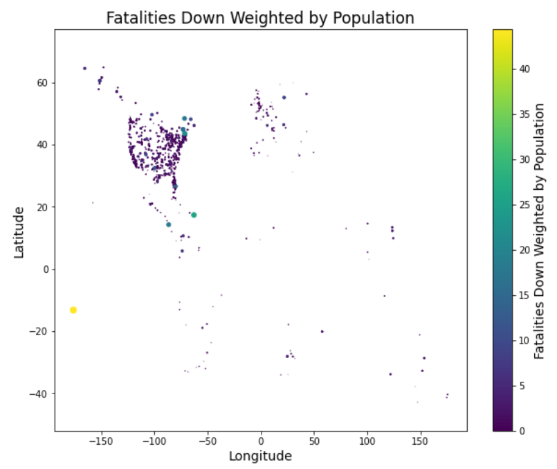
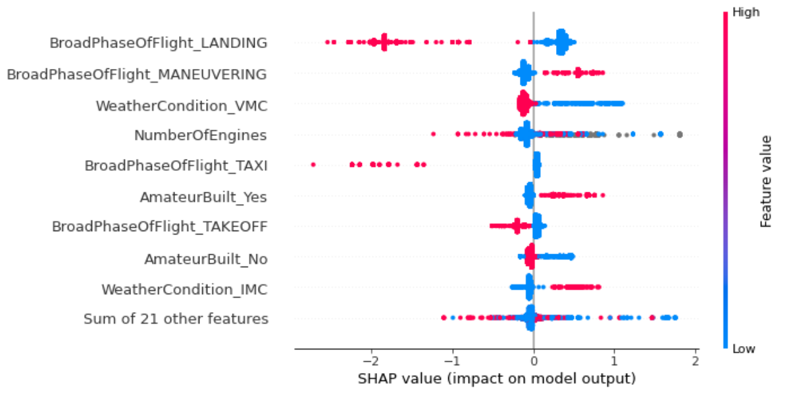
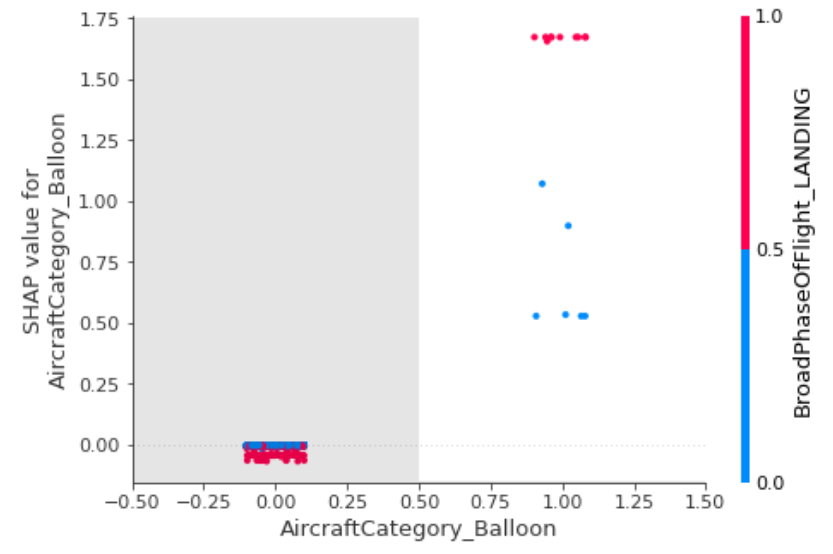

## RTI CDS Analytics Exercise 02
I was able to perform some exploratory data analysis and I hope you are able to find it useful.  The overall theme of the findings are two fold.  Firstly there is evidence that shows small craft incidents involving a fatality occur at a substantially higher rate than large craft.  Secondly the aspects that influence the occurrence of a fatality differ between large and small craft.  For the purposes of this EDA I define large craft as what people would typically fly commercially on e.g. JetBlue.  Small craft are defined as everything else from DIY planes to helicopters.

Incidents per year have decreased steadily since 1982.  It is unknown whether this is due to improvement in safety measures or some sort of anomaly in record taking.  Overall injuries and fatalities follow this trend as well with roughly 1 in 10 incidents containing a fatality.

An assumption was made on the missing values in the AirCarrier field. The assumption being that the missing values in this field represented aircraft that didn't belong to any major AirCarrier and are therefore less likely to be a large commercial flight.  If this assumption holds then fatalities occur in roughly 7% of major AirCarrier incidents.  This is in contrast to the fatalities that occur in 20% of the non-major AirCarrier flights.

That said I think it is safe to assume that when fatalities do occur in large carrier planes the number of fatalities per incident are much larger.  For example below is a scatter plot of the Latitudes and Longitudes of incidents containing fatalities.  Size and color both represent the sum of fatalities down weighted by population of the city in which the incident occurred.

Notice large circles in popular travel destinations like the Carribean and Hawaii.  But look North of NY and you will see a few larger dots one of which represents a crash that occurred in Gander Canada and took the lives of 248 people.

In order to determine some of the reasons flight incidents were more lethal than others I trained a model to predict a binary response of Fatal Incidents and Nonfatal Incidents. In order to account for the decreasing occurence of flight incidents over time I used the months of June as a test set and trained on incidents occurring outside of June.  I was not interested in using this model to make predictions but rather to gather the feature importance information using Shapley Values.

Above are the feature importances of the model. And while it may take a data scientist to interpret these the main takeaways are this:  Features at the top are most important and the more separated the dots are from the center the stronger the weight that feature will have on the model output.  Notice the colors tend to group together and this is because the color red represents a high value for that feature.  Take a look at the first feature BroadPhaseOfFlight_Landing.  This means, you guessed it, the incident occured during landing.  From this table we are able to gather that being in the landing phase when the incident occurs is our strongest indication for there being NO Fatalities.  While this held true for planes the relationship was inverted for blimps, helicopters and gliders.  If this surprises you and you want to see a deeper analysis into shapley values see the jupyter notebook EDA.ipynb.  DIY built planes were also a feature that had a strong push toward the incident involving fatalities.

Finally, analysis of the narrative and probable_cause fields were informative.  Probable causes of fatal incidents included examples like suicide, colliding with mountains, ground or water.  For non-fatal incidents collisions occurred with unknown objects, deer, animals, powerlines, and a horse.  Collisions with birds occurred both in fatal and non-fatal incidents.

To address peoples' fear of flying.  Fatal incidents rarely occurred during landing in typical planes, which tends to be the most frightening part of flying.  The opposite is true for balloon aircrafts and DIY aircraft. Turns out most gyrocrafts are built by amateurs.  Incidents that occur while taxiing are generally nonfatal although not exclusively.  For incidents that occurred while taxiing important terms extracted included fire, fueling issues, and collision with vehicles on the runway.

# Appendix and More Confusing Figures

## Be Careful Landing Your Balloon!

Shapley values can also show non linear relationships between features.  While not the best example, this case has two binary variables Aircraft_Balloon (0 not a balloon or 1 a balloon) and BroadPhaseOfFlight_Landing (0 incident occured during not landing vs 1 incident occured during landing).  Each dot represents an individual observation.  I'm sorry for showing the x-axis as a float as that is misleading; however, I didn't have time to make my own plots for each variable so I just used the default behavior within the Shapley package.  It should be binary and represent if the aircraft is a balloon or not a balloon.  The y-axis is correctly a float and represents the shapley values.  These are on the same scale as the output of the model which in this case probability.  If you're still reading this you may be saying "Wow how can these balloons have a 1.6ish probability containing a fatal incident?!" That's a great observation!  Shapley Values are based on game theory and the features for each observation are in a zero sum game to gain the most credit for the model output.  The prediction for each observation will be equal to the sum of the shapley values for that observation's respective features.  That said the "probability" or Shapley Value for an individual observation and feature may be larger than 1!  Despite this the sum of all the features for that observation will always be less than 1.
